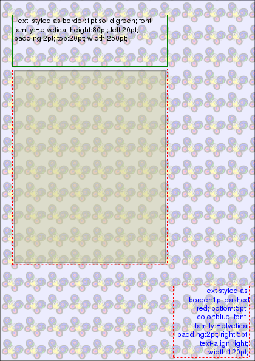

PDF-Style-p6
============
__Experimental!__

This is an extension module for `PDF::Lite` and `PDF::API6`, etc. It implements some basic CSS styling rules for simple PDF components, such as forms, images, or plain text blocks.

## Supported Properties

Type | Properties
---  | ---
Borders | border-color, border-style ('dotted', 'dashed', 'solid' only),  border-width, padding, margin
Backgrounds | background-color, background-image (url encoded only), background-position, background-repeat
Sizing  | height, max-height, min-height, width, max-width, min-width
Text | font-family, font-style, font-size, font-kerning, font-stretch, font-weight, color, letter-spacing, line-height, text-align vertical-align ('top', 'center', 'bottom' only), word-spacing 
Positioning  | bottom, top, left, right
Viewport | size, (also border and background properties: padding, border, margin, background-color, etc)
Other | opacity

## Simple Styling

```
use v6;
use PDF::Lite;
use PDF::Style;
use CSS::Declarations;
use CSS::Declarations::Units :pt, :ops;

my $pdf = PDF::Lite.new;
my $page = $pdf.add-page;
$page.media-box = 0, 0, 120, 150;

# create and output a styled text-block
my $css = CSS::Declarations.new: :style("font-family:Helvetica; width:250pt; height:80pt; border: 1pt dashed green; padding: 2pt; word-spacing:3pt");

my $text = q:to"--ENOUGH!!--".lines.join: ' ';
    Lorem ipsum dolor sit amet, consectetur adipiscing elit, sed do eiusmod tempor incididunt
    ut labore et dolore magna aliqua. Ut enim ad minim veniam, quis nostrud exercitation ullamco.
    --ENOUGH!!--

my $text-elem = PDF::Style.element( :$text, :$css );

# display it on the page
$page.gfx.do( .xobject, .bottom, .left) with $text-elem;
```

Elements positions and sizes on a viewport are calculated from CSS properties `top`, `right, `bottom`, `left`, `width` and `height`.

The `render` method places an element directly on a parent page, xobject or pattern, positioning it at the element's `top`, `left` coordinates.


```
use v6;
use PDF::Lite;
use PDF::Style::Viewport;
use PDF::Style::Element;
use CSS::Declarations;
use CSS::Declarations::Units :pt, :ops;
use PDF::Content::Image;
use PDF::Content::XObject;

my $pdf = PDF::Lite.new;
my PDF::Content::XObject $background-image = PDF::Content::Image.open("t/images/tiny.png");
my $vp = PDF::Style::Viewport.new: :style("background-color: rgb(180,180,250); background-image: url($background-image); opacity: 0.25; width:420pt; height:595pt");
# Create and resize a page to fit the viewport.
# Also style the page, adding any borders or background for the viewport
my $page = $vp.decorate: $pdf.add-page;
# create and lay up some styled elements
my $css = CSS::Declarations.new: :style("font-family:Helvetica; width:250pt; height:80pt; top:20pt; left:20pt; border: 1pt solid green; padding: 2pt");

my $text = qq:to"--ENOUGH!!--".lines.join: ' ';
    Text, styled as $css
    --ENOUGH!!--

my PDF::Style::Element $text-elem = $vp.element( :$text, :$css );

note "text top-left is {.top}pt {.left}pt from page bottom, left corner"
    given $text-elem;

# output the element on the page.
$page.gfx.do(.xobject, .left, .bottom) with $text-elem;

# now position an image below the text block,
# after some styling adjustments
$css.border-color = 'red';
$css.border-style = 'dashed';
$css.top ➕= ($text-elem.height('padding') + 5)pt;
$css.delete('height');

my Str $image = "t/images/snoopy-happy-dance.jpg";
my PDF::Style::Element $image-elem = $vp.element(:$image, :$css);
note "image bottom-right is {.bottom}pt {.left}pt from page bottom, left corner"
    given $image-elem;
$page.gfx.do(.xobject, .left, .bottom) with $image-elem;

# positon from bottom right
$css = CSS::Declarations.new: :style("border:2pt dashed green; bottom:5pt; color:blue; font-family:Helvetica; padding:2pt; right:5pt; text-align:right; width:120pt;");
$page.gfx.do(.xobject, .left, .bottom)
    given $vp.element( :text("Text styled as $css"), :$css );

$pdf.save-as: "t/example.pdf";
# also save as HTML
"t/example.html".IO.spurt: $vp.html;
```


## CSS Property todo lists:

Property|Notes|To-do
---|---|---
border-style|'dotted', 'dashed', 'solid'|Other styles.
text-decoration||NYI
text-indent||NYI
text-transform||NYI
vertical-align|'top', 'center', 'bottom' only|Other modes
  
### CSS Property Shortlist
- content
- direction
- display
- font-variant
- empty-cells
- float
- list-style, list-style-image, list-style-position, list-style-type
- outline, outline-width, outline-style, outline-color
- overflow
- unicode-bidi
- table-layout
- visibility
- white-spacing

### Nice to have:

Fonts:
- font-synthesis
- @font-face

Viewport
- @top-left-corner, etc
- page-break-before, page-break-after, page-break-inside

CSS Transforms http://dev.w3.org/csswg/css-transforms/#transform
- transform
- transform-origin

